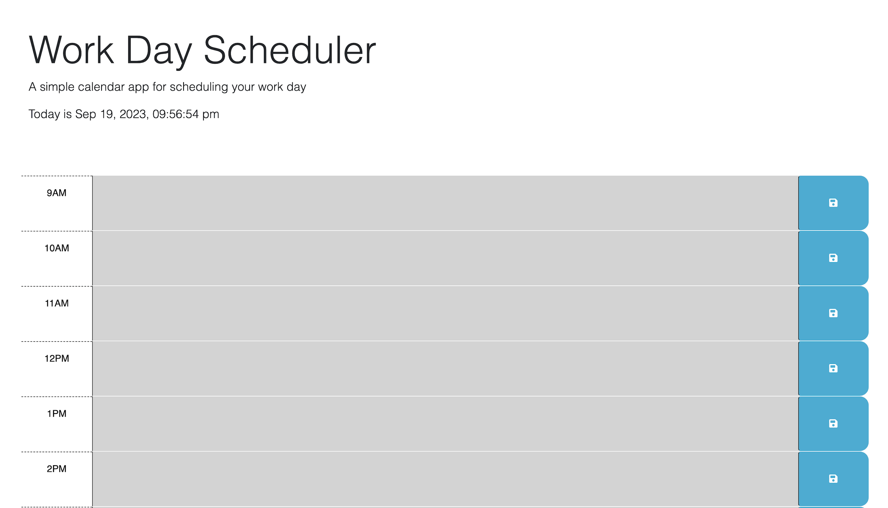

# **Workday Scheduler**

## **Description**

This website was created to provide the user with a scheduler for their workday..

## **Usage**

Navigate to this URL: https://jnc2248.github.io/work-day-scheduler/

The current date and time is displayed at the top of the page. The scheduler’s time blocks are color coded to display if it is in the past, present, or future, for easy viewing. Enter to-do items directly into the scheduler by clicking a time block and entering text. Then press the blue save button to the right of each time block. Scheduled items will be saved on the page until the user deletes them.

